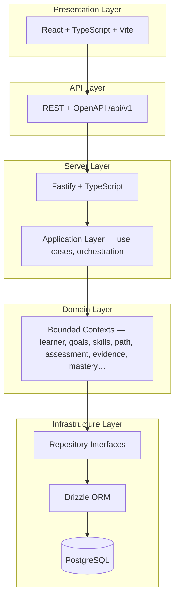
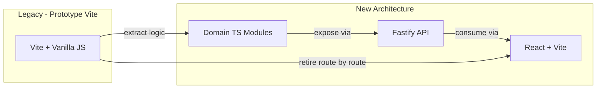
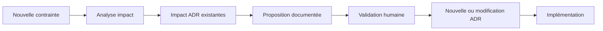

# Learnova — Architecture Baseline

**Version :** Phase 2.1-B  
**Date :** 2026-09-03  
**Statut document :** BASELINE READY FOR HUMAN VALIDATION

---

## Table des matières

1. [Purpose & Scope](#1-purpose--scope)
2. [Product & Architectural Context](#2-product--architectural-context)
3. [Current State](#3-current-state)
4. [Target Architecture](#4-target-architecture)
5. [Architectural Principles](#5-architectural-principles)
6. [Domain Architecture](#6-domain-architecture)
7. [MVP Domain Boundaries](#7-mvp-domain-boundaries)
8. [Domain Invariants](#8-domain-invariants)
9. [AI Architecture & Governance](#9-ai-architecture--governance)
10. [Security & Multi-tenancy](#10-security--multi-tenancy)
11. [Data Architecture](#11-data-architecture)
12. [API Architecture](#12-api-architecture)
13. [Authentication & Session Architecture](#13-authentication--session-architecture)
14. [Observability, Domain Events & Audit](#14-observability-domain-events--audit)
15. [Testing Strategy](#15-testing-strategy)
16. [Migration Baseline](#16-migration-baseline)
17. [Migration Stages](#17-migration-stages)
18. [First Vertical Slice](#18-first-vertical-slice)
19. [Engineering Constitution](#19-engineering-constitution)
20. [Architecture Decision Records](#20-architecture-decision-records)
21. [ADR Coherence Matrix](#21-adr-coherence-matrix)
22. [Deferred Decisions](#22-deferred-decisions)
23. [Architectural Change Process](#23-architectural-change-process)
24. [Phase 2.2 Entry Criteria](#24-phase-22-entry-criteria)
25. [Architecture Baseline Status](#25-architecture-baseline-status)

---

## 1. Purpose & Scope

### Rôle du document

Ce document constitue la **baseline architecturale officielle** de Learnova pour la Phase 2. Il consolide les décisions validées lors de la Phase 2.1-B (Architecture Baseline & Decision Record) et sert de référence unique pour toutes les phases d’implémentation futures.

### Périmètre

| Inclus | Exclu |
|--------|-------|
| Vision produit et contexte architectural | Spécifications UI détaillées |
| État actuel du prototype (Prototype 0) | Schéma SQL détaillé |
| Architecture cible validée | Catalogue exhaustif d’endpoints API |
| Principes, invariants et ADR | Implémentation de code |
| Frontières MVP / V1.1 / V2 | Décisions non encore validées |

### Documents connexes

- [`docs/vision.md`](vision.md) — Vision produit
- [`docs/domain-model.md`](domain-model.md) — Modèle de domaine
- [`docs/product-principles.md`](product-principles.md) — Principes non négociables
- [`docs/architecture.md`](architecture.md) — État des lieux Prototype 0 (historique)
- [`docs/migration-map.md`](migration-map.md) — Matrice de migration fichier par fichier
- Phase 1.5 — Référentiel stratégique et fonctionnel (personas, MVP, exigences)

### Distinction fondamentale

Ce document distingue explicitement :

- **État actuel** — ce qui existe et fonctionne aujourd’hui dans le dépôt
- **Architecture cible** — ce qui est décidé mais pas encore entièrement implémenté
- **Décision différée** — ce qui reste à définir ultérieurement

---

## 2. Product & Architectural Context

### Vision Learnova

Learnova est une **Learning Intelligence Platform** — pas un LMS traditionnel avec un chatbot. C’est un **GPS des compétences** orienté destination :

> Ne cherchez plus quel cours suivre. Dites-nous où vous voulez aller.

Source : [`docs/vision.md`](vision.md)

### Positionnement

| LMS traditionnel | Learnova |
|------------------|----------|
| « Quel cours voulez-vous ? » | « Quel objectif voulez-vous atteindre ? » |
| Catalogue centré contenu | Itinéraire centré destination |
| Progression = consommation | Progression = avancement + preuve |
| Complétion = terminé | Complétion = evidence + règles métier |

### Modèle économique (Phase 1.5)

Learnova vise un modèle **B2B SaaS** :

```
Organization → Programs → Cohorts → Learners
```

Chaque organisation constitue une frontière tenant. Les programmes empaquettent l’offre pédagogique ; les cohortes regroupent les apprenants dans le temps.

### Principe fondateur : Goal before Content

Aucune activité d’apprentissage n’est proposée sans être **justifiée par un objectif** et **rattachée à une compétence** sur un chemin explicite.

Source : [`docs/product-principles.md`](product-principles.md)

### Chaîne Learning Intelligence (architecture cible)

```
GOAL
  → SKILLS
  → LEARNER STATE
  → ADAPTIVE PATH
  → LEARNING
  → EVIDENCE
  → MASTERY
```

Cette chaîne est le noyau conceptuel de Learnova. Le prototype actuel en couvre une tranche simplifiée (voir section 3).

---

## 3. Current State

> **État actuel** — Prototype 0 fonctionnel. L’architecture cible (section 4) n’est **pas** entièrement déployée.

### Stack runtime active

| Couche | Technologie | Fichiers |
|--------|-------------|----------|
| Build | Vite 7 | `package.json`, `index.html` |
| UI | JavaScript vanilla, HTML strings | `src/views/*.js`, `src/style.css` |
| Routing | Hash router maison | `src/router.js` |
| État | Singleton module | `src/store.js` |
| Persistance | `localStorage` (`learnova-learner`) | `src/store.js` |
| IA | MockAIService (local, déterministe) | `src/ai/*` |
| Contenu | Leçons statiques | `src/data/lessons.js` |
| Logique quiz | Fonctions pures | `src/shared/assessment.js` |

### Parcours utilisateur actif

```
Landing (#/)
  → Goal (#/goal)
  → Roadmap (#/roadmap)     [génération Mock AI]
  → Dashboard (#/dashboard)
  → Lesson (#/lesson)
  → Quiz → Validation → Progression
```

Source : [`README.md`](../README.md), [`src/main.js`](../src/main.js)

### Contrats TypeScript (Phase 0)

| Fichier | Contenu | Branché au runtime ? |
|---------|---------|---------------------|
| `src/shared/types/domain.types.ts` | Goal, Skill, Evidence, Mastery, Assessment… | **Non** |
| `src/shared/types/learner.types.ts` | LearnerProfile, LearnerState, PathStepSnapshot… | **Non** |

`tsconfig.json` scope : `src/shared/types/**/*.ts` — strict mode, `noEmit: true`.

### Tests et CI

| Suite | Outil | Volume | Rôle |
|-------|-------|--------|------|
| Unit tests | Vitest + jsdom | 25 tests | Store, assessment, Mock AI |
| E2E tests | Playwright (Chromium) | 10 tests | Parcours golden (TEST-E2E-001→008 + scénarios validation) |
| Typecheck | TypeScript | Contrats types | Non-runtime |
| CI | GitHub Actions | push/PR | typecheck → test → build → test:e2e |

Source : [`.github/workflows/ci.yml`](../.github/workflows/ci.yml)

### Limites connues (Prototype 0)

| Limite | Impact |
|--------|--------|
| Single-user, client-only | Pas de multi-tenant, pas d’auth |
| Pas de backend | Pas de persistance serveur, pas de sync |
| Evidence implicite | Quiz validé mais pas d’entité Evidence persistée |
| Mastery non modélisé | `skills[]` = liste de noms, pas de niveaux de maîtrise |
| Skill = string label | Pas de référentiel Skill réutilisable |
| Pas de diagnostic structuré | Intake limité au formulaire Goal |
| Mock AI template matching | Parcours non adaptatif au profil réel |
| Types TS déconnectés | Contrats Phase 0 non consommés par le runtime JS |

### Ce qui n’est PAS l’état actuel

Les éléments suivants font partie de l’**architecture cible** (section 4) et ne doivent pas être présentés comme déployés :

- React, Fastify, PostgreSQL, Drizzle
- Multi-tenancy, RBAC serveur
- Evidence et Mastery persistés
- API REST `/api/v1/`

---

## 4. Target Architecture

> **Architecture cible** — Décisions validées Phase 2.1-B. Implémentation progressive (section 17).

### Stack cible

```
React + TypeScript + Vite
        ↓
REST + OpenAPI
        ↓
Fastify + TypeScript
        ↓
Application Layer
        ↓
Domain Layer
        ↓
Repository Interfaces
        ↓
Drizzle
        ↓
PostgreSQL
```

### Diagramme des couches



### Responsabilités par couche

| Couche | Responsabilité | Ne fait PAS |
|--------|----------------|-------------|
| **Presentation** (React + Vite) | UI, routing client, formulaires, dashboards, visualisation mastery | Règles métier, persistance directe |
| **API** (REST + OpenAPI) | Contrats HTTP, validation entrées, auth middleware, sérialisation | Logique domaine, accès DB direct |
| **Server** (Fastify) | Routing HTTP, middleware, injection dépendances, orchestration requêtes | Règles métier pures |
| **Application** | Use cases, coordination domaine + infra, transactions | Rendering UI, SQL direct |
| **Domain** | Entités, invariants, services métier, policies | Dépendance framework/ORM |
| **Repository Interfaces** | Ports de persistance (contrats) | Implémentation SQL |
| **Infrastructure** (Drizzle + PostgreSQL) | Implémentation repositories, migrations, requêtes | Règles métier |

### Modular Monolith

Un **seul déploiement**, organisé en **bounded contexts** (DDD) avec dépendances unidirectionnelles. Pas de microservices au MVP.

Modules domaine cibles :

```
organization │ program │ cohort │ learner │ goals │ diagnostic
skills │ learning-path │ content │ assessment │ evidence │ mastery │ analytics
```

---

## 5. Architectural Principles

| Principe | Description |
|----------|-------------|
| **Domain first** | Le domaine est extrait et testé avant toute migration UI ou infra |
| **Séparation des couches** | Presentation / Application / Domain / Infrastructure — dépendances unidirectionnelles vers le domaine |
| **Dependency inversion** | Le domaine dépend d’interfaces (ports), pas d’implémentations concrètes |
| **Provider agnostic** | IA, persistance, auth interchangeables via adapters |
| **Business rules in domain** | Seuils, validation, progression, mastery — règles explicites et testables |
| **Explainability** | Décisions significatives (parcours, adaptation) portent une `rationale` |
| **Security by design** | Tenant isolation, RBAC, contrôles côté serveur dès le MVP |
| **Testability** | Logique pure testable sans DOM, sans DB, sans LLM |
| **Modularity** | Bounded contexts avec interfaces explicites |
| **Progressive migration** | Strangler fig — pas de big-bang rewrite |

### Règle centrale

```
RULES + DATA + MODELS + AI
```

L’IA **assiste** ; les **règles du domaine** **décident**. L’architecture n’est pas « AI everywhere ».

Source : [`docs/product-principles.md`](product-principles.md) — principes 5 et 6.

---

## 6. Domain Architecture

> Source principale : [`docs/domain-model.md`](domain-model.md), contrats [`src/shared/types/`](../src/shared/types/)

### Concepts métier

| Concept | Responsabilité |
|---------|----------------|
| **Organization** | Tenant B2B — frontière de sécurité et de données |
| **Program** | Offre pédagogique empaquetée (modules, skills cibles) |
| **Cohort** | Groupe d’apprenants dans un programme, borné dans le temps |
| **Learner** | Personne qui apprend — identité, profil, préférences |
| **Goal** | Destination d’apprentissage exprimée par l’apprenant |
| **Diagnostic** | Intake structuré produisant un profil baseline et des lacunes |
| **Skill** | Compétence référentielle réutilisable (Skill Graph) |
| **LearnerSkill** | État d’un apprenant vis-à-vis d’une Skill (niveau, preuves) |
| **Skill Gap** | Écart entre niveau cible et niveau actuel sur une Skill |
| **Learner State** | État de session / parcours actif de l’apprenant |
| **Learning Path** | Itinéraire ordonné d’étapes menant à l’objectif |
| **Activity** | Unité pédagogique consommable (micro-learning, exercice…) |
| **Assessment** | Mécanisme d’évaluation lié à une activité |
| **Evidence** | Preuve tangible produite par un assessment |
| **Mastery** | Niveau de maîtrise **évalué** d’une compétence |

### Noyau Learning Intelligence


### Distinctions fondamentales

| Distinction | Signification |
|-------------|---------------|
| **Learner ≠ Learner State** | Learner = identité stable ; Learner State = snapshot session/parcours courant |
| **Skill ≠ LearnerSkill** | Skill = référentiel générique ; LearnerSkill = état individuel + preuves |
| **Goal ≠ Skill** | Goal = destination ; Skills = décomposition en capacités observables |
| **Progress ≠ Mastery** | Progress = avancement sur l’itinéraire (% étapes) ; Mastery = niveau évalué fondé sur Evidence |
| **Assessment ≠ Evidence** | Assessment = mécanisme ; Evidence = artefact produit par une tentative |

### Relations organisationnelles (cible)

```
Organization → Programs → Modules → Activities → Assessments
Organization → Cohorts → Learners
Learner → Goals → Diagnostic → Skill Profile → Skill Gaps
Learner → Learner State → Learning Path → Evidence → Mastery
```

---

## 7. MVP Domain Boundaries

> Sources : Phase 1.5 (référentiel produit), [`docs/product-principles.md`](product-principles.md)

### MVP (Must Have)

| Domaine | Périmètre MVP |
|---------|---------------|
| Auth + tenant | Organisation, session, rôles minimaux |
| Goal | Capture, analyse, confirmation |
| Diagnostic | Intake profil → baseline skills |
| Skills | Registre minimal + LearnerSkill + SkillGap |
| Learning Path | Génération rules + mock/AI assist |
| Activity + Assessment | Livraison contenu + quiz |
| Evidence | Persistance + gate de complétion |
| Mastery | Niveaux basiques dérivés des Evidence |
| Learner Dashboard | Console apprenant |
| Organization Management | Settings org, programmes, membres (program builder lite) |
| Simplified Trainer Dashboard | Progression cohorte, visibilité apprenants assignés (vue basique) |
| Tests | Golden Path E2E + domain unit tests |

### V1.1 (Should Come After Core Loop)

- Advanced Trainer Dashboard (capabilities formateur avancées, détection apprenants à risque avancée)
- Advanced Organization Analytics
- LearningEvent stream
- Content authoring UI
- Real LLM provider (assist optionnel)

### V2 (Deferred)

- AI Mentor UI
- Notifications
- Advanced analytics / predictive intelligence
- Marketplace
- Mobile apps
- Public API
- SSO / enterprise IdP
- Advanced skill graph visualization
- Remediation engine / Next Best Action

### Hors périmètre (Do Not Build)

- Microservices split
- Full CMS
- Custom ML training pipeline
- Big-bang rewrite du prototype
- Event sourcing complet

---

## 8. Domain Invariants

Les **11 invariants** suivants (I-01 à I-11) sont **non négociables**. Toute implémentation doit les respecter.

| # | Invariant | Description |
|---|-----------|-------------|
| I-01 | **Goal before Content** | Aucune activité sans objectif confirmé et compétence cible |
| I-02 | **Goal ≠ Skill** | Un objectif est une destination ; les skills en sont la décomposition |
| I-03 | **Progress ≠ Mastery** | La progression sur le path ne détermine pas le niveau de maîtrise |
| I-04 | **Evidence before Mastery** | Pas de mastery sans evidence validée |
| I-05 | **Evidence before Completion** | Pas de `step.status = done` sans evidence `passed = true` |
| I-06 | **Learner State evolves** | L’état apprenant mute via events domaine, pas par mutation UI directe |
| I-07 | **Adaptive Path** | Le parcours s’adapte aux gaps et preuves — pas figé arbitrairement |
| I-08 | **AI is not authority** | L’IA propose ; les règles métier décident |
| I-09 | **Explainability** | Décisions significatives portent une justification (`rationale`) |
| I-10 | **Tenant Isolation** | Toute donnée est scopée par `organizationId` ; accès vérifié côté serveur |
| I-11 | **Domain independence** | Le domaine ne dépend ni de React, ni de Fastify, ni de Drizzle |

---

## 9. AI Architecture & Governance

### Modèle : AI-assisted / rule-governed

```
"AI proposes; business rules decide."
```

**LLM output ≠ Business truth.**

### Où l’IA intervient (assist)

| Capacité | Rôle IA | Décideur final |
|----------|---------|----------------|
| Goal Intelligence | Clarifier / structurer un objectif textuel | Règles domaine + confirmation apprenant |
| Skill Intelligence | Suggérer décomposition en skills | Registre skills + validateurs |
| Adaptive Path assistance | Proposer ordre / contenu d’étapes | Path engine + prérequis |
| Evidence interpretation | Résumer réponses ouvertes (futur) | Rubriques de scoring |
| Mastery assistance | Suggérer niveau de confiance | Mastery rules (Evidence-based) |

### Où l’IA ne intervient PAS

- Validation de quiz (seuils déterministes)
- Mutation directe de `LearnerState`, `Mastery`, ou progression
- Décisions de tenant isolation ou RBAC
- Persistance sans validation schema

### Architecture AI cible

```
ai/
  ports/           Interfaces (GoalAnalyzer, PathGenerator, MentorAssistant…)
  providers/
    mock/          MockAIService — dev, tests, démo
    llm/           Fournisseur réel (Décision différée)
  tasks/           Use cases IA (generatePath, analyzeGoal…)
  validators/      Validation post-IA (schema + invariants métier)
  prompts/         Templates versionnés
```

### Gouvernance

| Exigence | Implémentation |
|----------|----------------|
| Structured output | Réponses JSON validées par schema (Zod ou équivalent) |
| Validation | Validators domaine avant toute mutation d’état |
| Audit | Log prompts/inputs/outputs côté serveur |
| Non-determinisme | Golden tests utilisent Mock ; AI eval tests avec fixtures et bandes de tolérance |
| Interdiction | L’IA ne appelle jamais `completeStep()` ni ne modifie Mastery directement |

### État actuel

Prototype 0 : `MockAIService` via factory `getAIService()` — keyword template matching, déterministe, client-side. Contrat `AIService.js` avec `generatePath()` et `askMentor()` (non câblé en UI).

---

## 10. Security & Multi-tenancy

### Modèle B2B SaaS

```
Organization
  → Users (memberships)
  → Programs
  → Cohorts
  → Learners
```

### Principes

| Principe | Description |
|----------|-------------|
| **Authentication** | Sessions serveur — identité vérifiée avant tout accès |
| **Authorization** | RBAC côté **serveur** — jamais confiance au client seul |
| **Tenant isolation** | `organizationId` est la frontière de sécurité sur toutes les entités |
| **Auditabilité** | Mutations sensibles tracées (voir section 14) |
| **Confidentialité** | Données scopées par organisation ; pas de fuite cross-tenant |

### Rôles MVP

| Rôle | Périmètre |
|------|-----------|
| **Learnova Admin** | Administration plateforme (multi-org) |
| **Organization Admin** | Settings org, programmes, membres |
| **Trainer** | Cohortes assignées, visibilité apprenants |
| **Learner** | Propres goals, path, evidence, mastery |

> **Note :** La matrice RBAC détaillée (permissions par ressource) est une **Décision différée** — à définir avec le packaging commercial Phase 1.5.

### État actuel

Prototype 0 : **aucune authentification, aucun multi-tenant**. Sécurité = responsabilité du navigateur local uniquement.

---

## 11. Data Architecture

### Source de vérité

| Phase | Persistance | Rôle |
|-------|-------------|------|
| Prototype 0 (actuel) | `localStorage` | Demo single-user |
| Migration | Coexistence localStorage + API | Strangler |
| Cible | **PostgreSQL** | Source de vérité unique |

### Accès aux données

| Couche | Technologie | Rôle |
|--------|-------------|------|
| Domain | Repository interfaces (ports) | Contrats de persistance |
| Infrastructure | **Drizzle ORM** | Implémentation repositories, migrations |
| Base | **PostgreSQL** | Stockage relationnel multi-tenant |

### Indépendance du domaine

Le domain layer **ne dépend pas** de Drizzle ni de PostgreSQL. Les repositories implémentent des interfaces définies par le domaine. Drizzle est un détail d’infrastructure interchangeable.

### Données persistantes (cible MVP)

Organization, Program, Cohort, Learner, Goal, Diagnostic, Skill, LearnerSkill, SkillGap, LearnerState, LearningPath, PathStep, Activity, Assessment, Evidence, Mastery, User, OrganizationMembership.

### Rôle résiduel de localStorage

Pendant la migration (stages M1–M6), `localStorage` peut subsister pour :

- Mode demo offline du prototype Vite
- Cache client non autoritaire
- Tests E2E du golden path legacy

`localStorage` n’est **jamais** source de vérité en production multi-tenant.

### Schéma SQL

**Décision différée** — le schéma physique détaillé sera défini lors de l’étape M4 (PostgreSQL + Drizzle).

---

## 12. API Architecture

### Style

| Décision | Valeur |
|----------|--------|
| Protocole | **REST** |
| Spécification | **OpenAPI 3.x** |
| Préfixe | `/api/v1/` |
| Versionnement | URL prefix (`/v1/`) ; breaking changes = `/v2/` |

### Principes

| Principe | Description |
|----------|-------------|
| Thin controllers | Routes HTTP délèguent aux application services |
| Validation entrées | Schema validation (Zod) à la frontière API |
| Pas de logique domaine | L’API orchestre, le domaine décide |
| Tenant scoping | `organizationId` injecté depuis la session, jamais depuis le body seul |
| Sérialisation | DTOs API ≠ entités domaine |

### Organisation logique (aperçu, non exhaustif)

```
/api/v1/
  auth/              login, logout, session
  organizations/     tenant management
  programs/          catalog
  cohorts/           enrollment
  learners/          profile, state
  goals/             CRUD + analyze
  diagnostics/       run, results
  skills/            registry, learner-skills, gaps
  paths/             generate, retrieve, advance
  activities/        content delivery
  assessments/       definitions
  evidence/          record attempts
  mastery/           query, compute
```

### Alternatives rejetées

- **GraphQL** — complexité excessive pour le MVP CRUD (ADR-006)

---

## 13. Authentication & Session Architecture

### Modèle validé

| Aspect | Décision |
|--------|----------|
| Mécanisme | **Sessions serveur** |
| Transport | **Cookies HTTP-only** |
| Production | Flag `Secure`, `SameSite` approprié |
| Alternative rejetée | JWT stateless comme mécanisme principal |

### Modèle d’identité

```
User
  → OrganizationMembership (organizationId + role)
  → Session (server-side, révocable)
```

### Flux

1. `POST /api/v1/auth/login` — vérifie credentials, crée session serveur
2. Cookie `HttpOnly` retourné au client
3. Requêtes suivantes : middleware extrait session → injecte `userId`, `organizationId`, `role`
4. `POST /api/v1/auth/logout` — invalide session

### Détails d’implémentation différés

| Élément | Statut |
|---------|--------|
| Librairie session (Lucia, custom, etc.) | À définir ultérieurement |
| Durée de session / refresh | À définir ultérieurement |
| Rate limiting login | À définir ultérieurement |
| Password hashing (argon2/bcrypt) | À définir ultérieurement |

---

## 14. Observability, Domain Events & Audit

### Trois niveaux

| Niveau | Contenu | Exemples |
|--------|---------|----------|
| **1. Technical logs** | Infra, HTTP, erreurs, latence | Request ID, status codes, stack traces |
| **2. Domain events** | Faits métier significatifs | GoalCreated, PathGenerated, EvidenceCreated |
| **3. Audit records** | Mutations sensibles, conformité | Changement de rôle, accès cross-tenant bloqué |

### Exemples de domain events

| Event | Déclencheur |
|-------|-------------|
| `GoalCreated` | Apprenant soumet un objectif |
| `DiagnosticCompleted` | Intake diagnostic terminé |
| `PathGenerated` | Parcours généré depuis goal + gaps |
| `AssessmentSubmitted` | Tentative de quiz soumise |
| `EvidenceCreated` | Preuve enregistrée |
| `MasteryChanged` | Niveau de maîtrise recalculé |
| `PathAdapted` | Parcours modifié suite à evidence/gap |

### Principes

- **PostgreSQL reste la source de vérité** — les events alimentent analytics et audit, pas un second store autoritaire
- **Event sourcing complet** — **Décision différée** (hors périmètre MVP)
- Les domain events MVP peuvent être persistés dans une table `domain_events` append-only

### État actuel

Prototype 0 : **aucun event log, aucun audit trail**.

---

## 15. Testing Strategy

### Pyramide de tests (cible)

```
        E2E (Playwright)           ← Golden Path, parcours complets
       /              \
  API / Integration tests         ← Auth, tenant, endpoints
     /                  \
Domain unit tests                  ← Règles métier pures, sans DOM/DB
```

### Types de tests

| Type | Outil | Cible |
|------|-------|-------|
| Domain unit tests | Vitest | Progression, evidence, mastery, goals, skills |
| Integration tests | Vitest + Fastify inject | Auth, tenant isolation, repositories |
| API tests | Vitest / supertest | Contrats REST |
| E2E tests | Playwright | Golden Path browser |
| AI evaluation tests | Vitest + fixtures | Mock determinism, tolerance bands pour LLM futur |
| Typecheck | TypeScript | Contrats stricts |

### Golden Path (spécification comportementale)

```
Goal → Diagnosis → Skills → Path → Activity → Assessment → Evidence → Mastery
```

Les tests E2E existants (TEST-E2E-001→008) couvrent la tranche prototype :

```
Goal → Roadmap → Dashboard → Lesson → Quiz → Validation → Progression
```

Ils restent des **golden tests** pendant toute la migration. Aucun test existant ne doit être affaibli.

### Mock AI determinism

`MockAIService` est le provider par défaut en dev et CI. Les tests de génération de parcours sont déterministes (keyword matching). Les tests AI evaluation futurs utiliseront des fixtures, pas des appels LLM live en CI.

### État actuel

| Suite | Volume | Statut |
|-------|--------|--------|
| Unit (Vitest) | 25 tests | Protégé |
| E2E (Playwright) | 10 tests | Protégé |
| Integration API | 0 | Cible M3 |
| Domain module unit | 0 | Cible M1 |

---

## 16. Migration Baseline

### Stratégie validée : Strangler Fig Pattern



### Principes de migration

| Principe | Description |
|----------|-------------|
| **Progressive extraction** | Extraire logique domaine en TS pur avant de migrer UI |
| **Vertical slices** | Livrer une tranche complète (domaine → API → UI) à la fois |
| **Golden Reference** | Le prototype Vite reste runnable jusqu’à parity prouvée |
| **Coexistence temporaire** | Legacy et new architecture coexistent — pas de big-bang |
| **Retrait legacy** | Une route/composant legacy n’est retiré qu’après E2E vert sur la replacement |
| **Tests d’abord** | Golden tests protègent le comportement à chaque étape |

### Anti-patterns interdits

- Big-bang rewrite (Prototype → React + API en une seule PR)
- Migration UI avant extraction domaine
- Affaiblir les tests golden pour faire passer la migration
- Supprimer le prototype avant parity E2E

Source : [`docs/migration-map.md`](migration-map.md), [`docs/architecture.md`](architecture.md)

---

## 17. Migration Stages

> Trajectoire validée. Chaque stage est indépendant — pas d’obligation de tout implémenter en une seule phase.

| Stage | Nom | Objectif | État |
|-------|-----|----------|------|
| **M0** | Baseline protégée | Tests E2E + unit + CI verts ; docs Phase 0–1.5 ; legacy nettoyé | **Done** |
| **M1** | Domain extraction | Modules TS purs (`src/modules/`) ; store.js → adapters ; domain unit tests | **Done** |
| **M2** | Application Services | Use cases orchestrant domaine + ports ; application tests | **Done** |
| **M3** | Fastify API | REST `/api/v1/` ; OpenAPI ; API integration tests (auth production = M5) | **Done** |
| **M4** | PostgreSQL + Drizzle | Repositories implémentés ; migrations ; seed data | Planned |
| **M5** | Authentication + Multi-tenancy | Sessions, RBAC, tenant isolation en production | Planned |
| **M6** | First complete Vertical Slice | Organization → Mastery end-to-end via API | Planned |
| **M7** | React | UI React + TypeScript + Vite consommant l’API ; retrait progressif views legacy | Planned |

### Dépendances entre stages

```
M0 → M1 → M2 → M3 → M4 → M5 → M6 → M7
         ↑                    ↑
    Domain first          Vertical slice
                          before full React
```

---

## 18. First Vertical Slice

### Chaîne cible

```
Organization
  → Program
  → Learner
  → Goal
  → Diagnostic
  → Skills
  → Skill Gaps
  → Learner State
  → Adaptive Path
  → Activity
  → Assessment
  → Evidence
  → Mastery
```

### Objectif

Prouver le **cœur Learning Intelligence** de Learnova de bout en bout : un apprenant authentifié dans une organisation parcourt la chaîne complète, avec evidence persistée et mastery calculée par règles métier — pas par l’IA.

### Definition of Done

| Critère | Validation |
|---------|------------|
| Apprenant authentifié dans une org | Session + tenant scoping |
| Goal capturé et confirmé | API + domaine |
| Diagnostic produit skill gaps | API + domaine |
| Path généré (rules + mock AI assist) | API + domaine |
| Activity livrée + quiz soumis | API + UI ou API directe |
| Evidence persistée en PostgreSQL | Repository + Drizzle |
| Mastery calculée depuis Evidence | Domain service, pas LLM |
| Golden Path E2E vert | Playwright |
| Domain unit tests verts | Vitest |
| API integration tests verts | Vitest + Fastify inject |
| Prototype Vite legacy intact ou route retirée avec parity prouvée | E2E |

### Ordre de construction (justification)

1. **Organization/Program** — frontière tenant (tout dépend de là)
2. **Learner + Auth** — identité requise pour état persisté
3. **Goal** — point d’entrée (Goal before Content)
4. **Diagnostic** — différenciation intelligence vs LMS
5. **Skills + Gaps** — adaptive path vs template matching
6. **Path** — réutilise MockAI/rules, scopé au programme
7. **Activity + Assessment** — schéma contenu existant (`lessons.js`)
8. **Evidence + Mastery** — boucle intelligence auditable

---

## 19. Engineering Constitution

Règles opérationnelles pour toute contribution future :

| # | Règle |
|---|-------|
| C-01 | **Domain independence** — le domaine ne importe ni React, ni Fastify, ni Drizzle |
| C-02 | **Dependency direction** — toujours vers le domaine (Presentation → Application → Domain ← Infrastructure) |
| C-03 | **AI governance** — l’IA ne mute jamais directement les états critiques |
| C-04 | **Tenant isolation** — `organizationId` sur toute requête et toute entité |
| C-05 | **Repository usage** — pas d’accès DB direct depuis Application ou Domain |
| C-06 | **Tests** — pas de merge si Golden Path E2E rouge |
| C-07 | **Golden Path** — les tests existants sont des spécifications, pas des obstacles |
| C-08 | **Migration** — strangler fig, vertical slices, pas de big-bang |
| C-09 | **Scope strict** — une PR = un slice ; pas de refactoring opportuniste |
| C-10 | **Plan before significant changes** — todo plan pour toute modification multi-fichiers |
| C-11 | **No implicit architectural decisions** — toute décision significative → ADR |
| C-12 | **New dependencies require justification** — pas de lib sans raison documentée |
| C-13 | **MVP boundaries** — respecter section 7 ; pas de feature V2 dans le MVP |
| C-14 | **Architecture evolves through explicit decisions** — pas de dérive silencieuse |
| C-15 | **Cursor/Codex may propose; they may not silently change an architectural decision** | |

---

## 20. Architecture Decision Records

### ADR-001 — Backend

| | |
|---|---|
| **Status** | Accepted |
| **Decision** | **Node.js + Fastify + TypeScript** |
| **Context** | MVP B2B nécessite un serveur API multi-tenant, testable, performant |
| **Alternatives considered** | Express (plus de boilerplate), NestJS (sur-engineering MVP), serverless (complexité cold start + sessions) |
| **Consequences** | Fastify `.inject()` pour tests API ; écosystème plugins ; équipe doit maîtriser TS côté serveur |

### ADR-002 — Persistence

| | |
|---|---|
| **Status** | Accepted |
| **Decision** | **PostgreSQL** comme source de vérité unique |
| **Context** | Modèle relationnel multi-tenant (org → cohort → learner → evidence) ; intégrité référentielle |
| **Alternatives considered** | MongoDB (relations complexes), SQLite (pas multi-tenant prod), Firebase (vendor lock-in) |
| **Consequences** | Nécessite hébergement PostgreSQL (Décision différée) ; migrations versionnées |

### ADR-003 — Monorepo

| | |
|---|---|
| **Status** | Accepted |
| **Decision** | **Monorepo unique** — prototype Vite + domain modules + server API |
| **Context** | Types partagés, CI unifiée, strangler migration |
| **Alternatives considered** | Polyrepo (frontend + backend séparés) — rejeté pour MVP (coordination) |
| **Consequences** | Structure claire requise ; `package.json` unique ; attention aux dépendances |

### ADR-004 — Frontend

| | |
|---|---|
| **Status** | Accepted |
| **Decision** | **React + TypeScript + Vite** — pas Next.js |
| **Context** | Composants réutilisables pour 3 expériences (learner, trainer, org) ; Vite déjà en place |
| **Alternatives considered** | Next.js (SSR non requis MVP, complexité migration), Vue (écosystème), rester vanilla JS (non scalable) |
| **Consequences** | Migration UI en M7, après domaine stable ; prototype vanilla reste golden reference jusqu’à parity |

### ADR-005 — Authentication

| | |
|---|---|
| **Status** | Accepted |
| **Decision** | **Sessions serveur** + cookies **HTTP-only** |
| **Context** | Apps web B2B ; révocation simple ; pas de JWT stateless comme mécanisme principal |
| **Alternatives considered** | JWT (révocation complexe), OAuth-only (pas de credentials MVP), localStorage tokens (insecure) |
| **Consequences** | Sticky sessions ou store session partagé si multi-instance (Décision différée) |

### ADR-006 — API

| | |
|---|---|
| **Status** | Accepted |
| **Decision** | **REST** + **OpenAPI 3.x** sous `/api/v1/` |
| **Context** | Clarté contrats, tooling, testabilité, équipe |
| **Alternatives considered** | GraphQL (overhead MVP), tRPC (couplage TS client/server), gRPC (pas browser-native) |
| **Consequences** | Spec OpenAPI maintenue ; versioning par URL prefix |

### ADR-007 — Data Access

| | |
|---|---|
| **Status** | Accepted |
| **Decision** | **Drizzle ORM** + **Repository interfaces** |
| **Context** | Type-safety, migrations, domaine indépendant de l’ORM |
| **Alternatives considered** | Prisma (génération client, couplage), raw SQL (maintenance), TypeORM (complexité) |
| **Consequences** | Drizzle reste en infrastructure layer ; repositories testables avec in-memory adapters |

### ADR-008 — Domain Architecture

| | |
|---|---|
| **Status** | Accepted |
| **Decision** | **Modular monolith** avec **DDD bounded contexts** |
| **Context** | MVP solo deploy ; complexité domaine élevée ; équipe petite |
| **Alternatives considered** | Microservices (prématuré), flat MVC (couplage), clean architecture sans bounded contexts (ambiguïté) |
| **Consequences** | Modules domaine sous `src/modules/` ; interfaces explicites entre contexts |

### ADR-009 — AI Architecture

| | |
|---|---|
| **Status** | Accepted |
| **Decision** | **AI-assisted, rule-governed** — ports + providers + validators |
| **Context** | Principes produit : AI assists, Rules decide ; explainability requise |
| **Alternatives considered** | AI-first (rejeté — non explainable), no AI (rejeté — valeur produit), RAG-only (insuffisant seul) |
| **Consequences** | Mock provider par défaut ; LLM réel opt-in ; validators obligatoires |

### ADR-010 — Observability & Audit

| | |
|---|---|
| **Status** | Accepted |
| **Decision** | Trois niveaux : technical logs + domain events + audit records |
| **Context** | B2B SaaS exige traçabilité ; analytics future |
| **Alternatives considered** | Event sourcing complet (prématuré), logs only (insuffisant audit), APM seul (pas domaine) |
| **Consequences** | Table `domain_events` append-only MVP ; event sourcing complet différé |

### ADR-011 — Testing

| | |
|---|---|
| **Status** | Accepted |
| **Decision** | Domain unit tests first + Golden Path E2E + API integration tests |
| **Context** | Baseline protégée Phase 1A/1B ; migration sans régression |
| **Alternatives considered** | E2E only (lent, fragile), TDD UI-first (couplage), no tests (rejeté) |
| **Consequences** | CI exige vert sur toutes les suites ; Mock AI determinism en CI |

### ADR-012 — Migration

| | |
|---|---|
| **Status** | Accepted |
| **Decision** | **Strangler fig** + **vertical slices** + **golden reference** |
| **Context** | Prototype fonctionnel existant ; pas de big-bang ; équipe réduite |
| **Alternatives considered** | Big-bang rewrite (risque régression), parallel run infini (dette), freeze prototype (bloque dev) |
| **Consequences** | Prototype Vite maintenu jusqu’à M7 ; extraction progressive M1→M6 |

---

## 21. ADR Coherence Matrix

Matrice de compatibilité entre les 12 ADR validées :

|  | 001 Backend | 002 PG | 003 Mono | 004 React | 005 Session | 006 REST | 007 Drizzle | 008 DDD | 009 AI | 010 Obs | 011 Test | 012 Migr |
|--|:-----------:|:------:|:--------:|:---------:|:-----------:|:--------:|:-----------:|:-------:|:------:|:-------:|:--------:|:--------:|
| **001 Backend** | — | ✓ | ✓ | ✓ | ✓ | ✓ | ✓ | ✓ | ✓ | ✓ | ✓ | ✓ |
| **002 PG** | ✓ | — | ✓ | ✓ | ✓ | ✓ | ✓ | ✓ | ✓ | ✓ | ✓ | ✓ |
| **003 Mono** | ✓ | ✓ | — | ✓ | ✓ | ✓ | ✓ | ✓ | ✓ | ✓ | ✓ | ✓ |
| **004 React** | ✓ | ✓ | ✓ | — | ✓ | ✓ | ○ | ✓ | ✓ | ○ | ✓ | ⚠ |
| **005 Session** | ✓ | ✓ | ✓ | ✓ | — | ✓ | ✓ | ✓ | ○ | ✓ | ✓ | ✓ |
| **006 REST** | ✓ | ✓ | ✓ | ✓ | ✓ | — | ✓ | ✓ | ✓ | ✓ | ✓ | ✓ |
| **007 Drizzle** | ✓ | ✓ | ✓ | ○ | ✓ | ✓ | — | ⚠ | ○ | ✓ | ✓ | ✓ |
| **008 DDD** | ✓ | ✓ | ✓ | ✓ | ✓ | ✓ | ⚠ | — | ✓ | ✓ | ✓ | ✓ |
| **009 AI** | ✓ | ✓ | ✓ | ✓ | ○ | ✓ | ○ | ✓ | — | ✓ | ✓ | ✓ |
| **010 Obs** | ✓ | ✓ | ✓ | ○ | ✓ | ✓ | ✓ | ✓ | ✓ | — | ✓ | ✓ |
| **011 Test** | ✓ | ✓ | ✓ | ✓ | ✓ | ✓ | ✓ | ✓ | ✓ | ✓ | — | ✓ |
| **012 Migr** | ✓ | ✓ | ✓ | ⚠ | ✓ | ✓ | ✓ | ✓ | ✓ | ✓ | ✓ | — |

**Légende :** ✓ = cohérent · ○ = indépendant · ⚠ = zone de vigilance

### Conclusion

**Aucun conflit architectural direct** n’a été identifié entre les 12 ADR.

### Zones de vigilance

| Zone | ADR impliquées | Risque | Mitigation |
|------|----------------|--------|------------|
| **React/Vite vs prototype legacy** | ADR-004, ADR-012 | Régression UI, double maintenance | Golden E2E ; retrait route par route |
| **AI vs business rules** | ADR-009, ADR-008 | IA mute état sans validation | Validators obligatoires ; Mock par défaut |
| **Drizzle vs Domain purity** | ADR-007, ADR-008 | Fuite ORM dans le domaine | Repository interfaces ; Drizzle en infra only |

---

## 22. Deferred Decisions

Les éléments suivants sont **volontairement non décidés**. Ils ne doivent pas être traités comme des décisions prises.

| # | Sujet | Statut |
|---|-------|--------|
| D-01 | Hébergement PostgreSQL (managed vs self-hosted) | À définir ultérieurement |
| D-02 | Version exacte Node.js LTS cible | À définir ultérieurement |
| D-03 | Cache / Redis (sessions, rate limiting) | À définir ultérieurement |
| D-04 | Fournisseur LLM réel (OpenAI, Anthropic, etc.) | À définir ultérieurement |
| D-05 | Fournisseur IAM externe / SSO enterprise | À définir ultérieurement |
| D-06 | GraphQL (couche API alternative) | Rejeté MVP ; réévaluation V2 si besoin |
| D-07 | Next.js (framework frontend) | Rejeté (ADR-004) ; réévaluation si SSR requis |
| D-08 | Event sourcing complet | À définir ultérieurement |
| D-09 | SSO / SAML / OIDC enterprise | À définir ultérieurement |
| D-10 | API publique (third-party integrations) | À définir ultérieurement |
| D-11 | Librairie session exacte (Lucia, custom…) | À définir ultérieurement |
| D-12 | Component library (Tailwind, shadcn…) | À définir ultérieurement |
| D-13 | Hosting provider (Vercel, Railway, AWS…) | À définir ultérieurement |
| D-14 | Matrice RBAC détaillée par ressource | À définir ultérieurement |
| D-15 | Schéma SQL détaillé | À définir ultérieurement (M4) |
| D-16 | Event bus technology (si nécessaire) | À définir ultérieurement |

---

## 23. Architectural Change Process

### Processus



### Règles

1. Toute contrainte nouvelle (produit, technique, réglementaire) déclenche une **analyse d’impact** sur cette baseline
2. Si une ADR existante est contredite → **proposition de modification ADR** avant tout code
3. La validation humaine est **obligatoire** pour toute modification de baseline
4. Cursor/Codex **peuvent proposer** des changements architecturaux — ils **ne peuvent pas** les appliquer silencieusement
5. Une modification ADR sans validation = violation de la Engineering Constitution (C-11, C-15)

---

## 24. Phase 2.2 Entry Criteria

Les conditions suivantes doivent être remplies **avant** de commencer l’implémentation Phase 2.2 :

| # | Critère | Statut |
|---|---------|--------|
| EC-01 | Baseline documentaire validée humainement | **En attente** (ce document) |
| EC-02 | Repository propre (Phase 1C legacy nettoyé) | Done |
| EC-03 | Tests existants verts (25 unit + 10 E2E + CI) | Done |
| EC-04 | Architecture cible comprise et documentée | Done (ce document) |
| EC-05 | MVP boundaries définies (section 7) | Done |
| EC-06 | First vertical slice défini (section 18) | Done |
| EC-07 | Aucune modification fonctionnelle pendant cette tâche documentaire | Requis |
| EC-08 | 12 ADR validées et cohérentes (section 20–21) | Done |

---

## 25. Architecture Baseline Status

```
Status: BASELINE READY FOR HUMAN VALIDATION
```

### Prochaines étapes

1. **Validation humaine** de ce document par le product owner / architecte
2. Une fois validé → statut passe à **FROZEN**
3. Toute modification post-FROZEN suit le processus section 23
4. Phase 2.2 (M1 — Domain extraction) peut commencer après FROZEN

### Ce document ne remplace pas

- [`docs/domain-model.md`](domain-model.md) — détail des entités et règles métier
- [`docs/product-principles.md`](product-principles.md) — principes produit non négociables
- [`docs/migration-map.md`](migration-map.md) — mapping fichier par fichier Prototype → cible
- Phase 1.5 — référentiel produit complet (personas, packaging, critères d’acceptation)

---

*Document produit dans le cadre de la Phase 2.1-B — Architecture Baseline & Decision Record.*  
*Aucune modification de code, configuration ou tests n'a accompagné sa création.*
